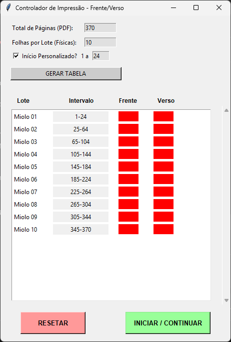

# 🖨️ Automador de Impressão para Papelaria (Agendas)

> Uma solução em Python para automatizar fluxos de impressão repetitivos e manuais.

## 📖 Sobre o Projeto



Este projeto nasceu de uma necessidade real dentro de casa. Observei minha esposa gastando horas valiosas do seu trabalho em uma tarefa exaustiva, manual e propensa a erros: o gerenciamento de impressões para encadernação de agendas.

Ela precisava calcular manualmente a quantidade de folhas, dividir em lotes (miolos), controlar a impressão frente e verso e configurar a impressora repetidas vezes no Adobe Acrobat.

Decidi então unir a programação à rotina dela. Criei esta aplicação para **automatizar esse trabalho chato e repetitivo**, garantindo precisão nos cálculos de páginas e liberando o tempo dela para focar na criação e venda dos produtos, enquanto o "robô" cuida da parte mecânica.

## 🚀 Funcionalidades Atuais (MVP)

Atualmente, o projeto está em fase de **MVP (Produto Viável Mínimo)**, focado especificamente na produção de **Agendas**.

* **Cálculo Automático de Lotes:** O usuário insere o total de páginas do PDF e a quantidade de folhas físicas por caderno (miolo), e o sistema gera a tabela de intervalos automaticamente.
* **Interface Gráfica (GUI):** Interface amigável feita com Tkinter para controle fácil, sem necessidade de mexer em código.
* **Automação de Cliques (RPA):** Utiliza `PyAutoGUI` para controlar o Adobe Acrobat Reader.
* **Visão Computacional (Computer Vision):** Utiliza `OpenCV` para encontrar **âncoras visuais** na tela. Isso impede que o robô "erre o clique" caso a janela do programa mude de posição ou resolução.
* **Controle de Estado:** Sistema de segurança que pausa entre "Frente" e "Verso", aguardando confirmação do usuário para evitar erros de alimentação de papel.

## 🛠️ Tecnologias Utilizadas

* **Linguagem:** Python 3.x
* **Interface:** Tkinter
* **Automação:** PyAutoGUI, PyGetWindow
* **Visão Computacional:** OpenCV (cv2), Pillow
* **Empacotamento:** PyInstaller (para gerar executável .exe)

## 🗺️ Roadmap e Futuro do Projeto

Como trabalhamos com diversos itens de papelaria personalizada, este software foi desenhado pensando em expansão. O objetivo é transformá-lo em uma central completa de automação.

- [x] **MVP:** Impressão de Agendas (Livreto/Booklet) com controle Frente/Verso.
- [ ] **Novos Produtos:** Adicionar predefinições para Bloquinhos, Cadernos A5 e Planners.
- [ ] **Configurações Flexíveis:** Permitir salvar perfis de impressão diferentes (ex: Papel Fotográfico vs. Papel Sulfite).
- [ ] **Integração de Pedidos:** Futuramente, ler arquivos de pedidos para organizar a fila de impressão automaticamente.
- [ ] **Auto-Update:** Sistema para atualizar o executável sem precisar reinstalar manualmente.

## 📦 Como Usar (Desenvolvimento)

1. Clone o repositório:
   ```bash
   git clone [https://github.com/Bakaloneking/Atomacao_Para_ImprimirAgendas.git](git@github.com:Bakaloneking/Atomacao_Para_ImprimirAgendas.git)

2. Instale as dependências:
   ```bash
   pip install -r requirements.txt

3. Certifique-se de ter a imagem ancora_paginas.png na raiz do projeto (um recorte do rótulo "Páginas" da janela de impressão do Adobe).

4. Execute o script:
   ```bash
    python Imprimir_automa.py